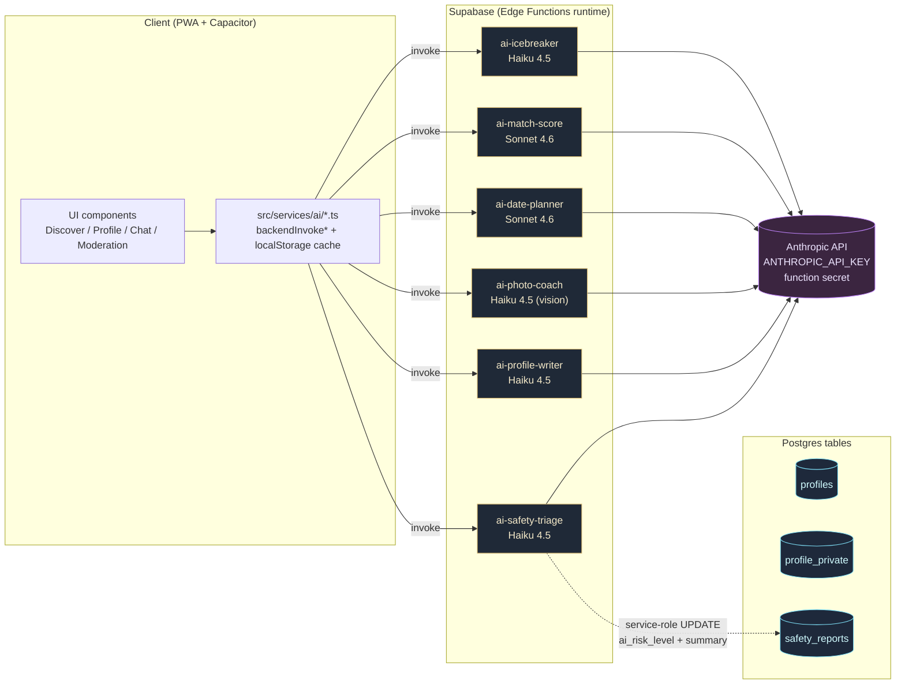
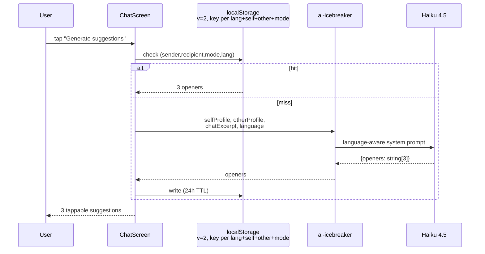
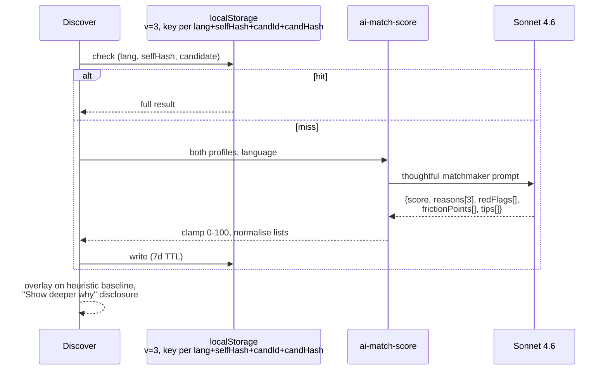
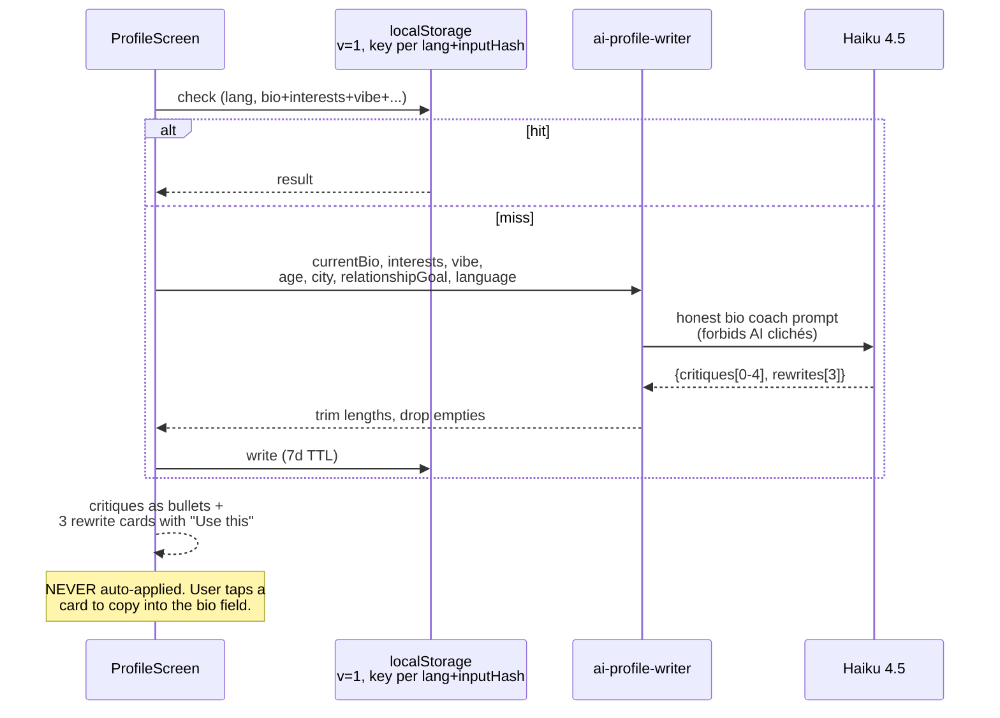
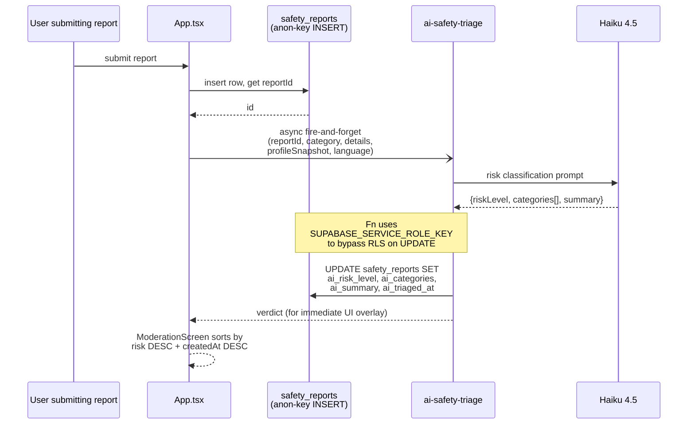
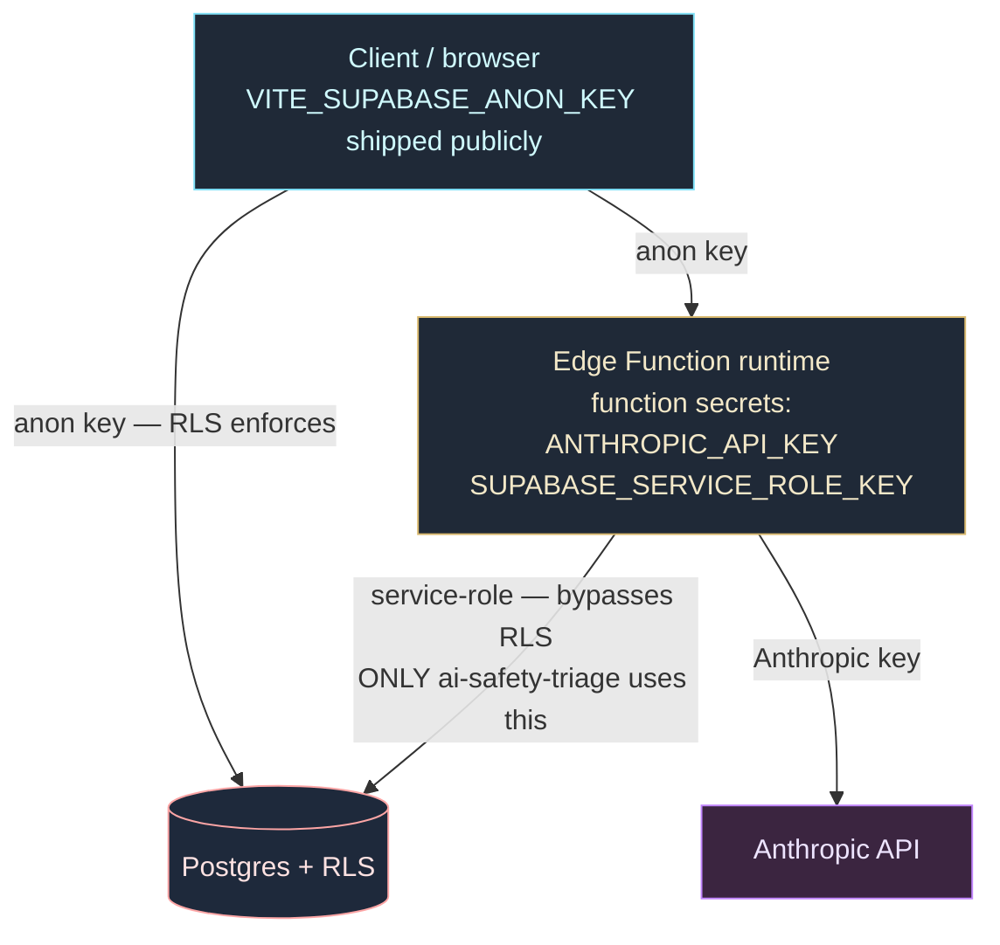

# LoveDate — AI architecture

Snapshot as of 2026-05-20 (commit family ending `f8b0d3c`). Six AI features ship across two Anthropic models. All six follow the same shape: client wrapper → Supabase Edge Function → Claude → response → client cache. The Anthropic key never leaves the server.

> Open this file in VS Code 1.121+ or on GitHub — both render the Mermaid diagrams natively. No extra extension needed.

---

## The whole picture



---

## Per-feature flows

### E1 — Icebreaker / chat coach



- **Lives at:** [supabase/functions/ai-icebreaker/index.ts](../supabase/functions/ai-icebreaker/index.ts)
- **Client:** [src/services/ai/icebreaker.ts](../src/services/ai/icebreaker.ts)
- **Cache:** `lovedate:ai-icebreaker:{lang}:{senderName}:{otherId}:{mode}` — 24h TTL, version 2
- **Falls back to:** hand-coded templates in `generateAiCoachSuggestions` if the call fails

### E3 + E6 — Match scoring with friction & tips



- **Lives at:** [supabase/functions/ai-match-score/index.ts](../supabase/functions/ai-match-score/index.ts)
- **Client:** [src/services/ai/matchScore.ts](../src/services/ai/matchScore.ts)
- **Cache:** profile-hash keyed — editing either profile invalidates automatically. CACHE_VERSION=3 (bumped when frictionPoints+tips added).
- **Falls back to:** heuristic `getMatchAnalysis` in App.tsx (interest overlap + intent + age gap + zodiac flavor)

### E4 — Date planner

```mermaid
sequenceDiagram
    participant Chat as ChatScreen
    participant Cache as localStorage<br/>v=1, key per lang+selfHash+otherId+otherHash
    participant Fn as ai-date-planner
    participant Claude as Sonnet 4.6

    Chat->>Cache: check (lang, both profile hashes)
    alt hit
        Cache-->>Chat: 3 plans
    else miss
        Chat->>Fn: both profiles, chemistryScore, language
        Fn->>Claude: 3 distinct plans (casual $ / mid $$ / signature $$$)
        Claude-->>Fn: {plans: [{title, placeType,<br/>budget, duration, pitch, message}]}
        Fn-->>Chat: normalise budget, clamp lengths
        Chat->>Cache: write (7d TTL)
    end
    Chat-->>Chat: 3 cards with "Use this message" → composer
```

- **Lives at:** [supabase/functions/ai-date-planner/index.ts](../supabase/functions/ai-date-planner/index.ts)
- **Client:** [src/services/ai/datePlanner.ts](../src/services/ai/datePlanner.ts)
- **Falls back to:** templated plan generator (the original pre-AI implementation) — kept as a fallback in `generateAiDatePlans`

### E2.5 — Photo quality coach

```mermaid
sequenceDiagram
    participant Editor as ProfileScreen
    participant Cache as localStorage<br/>v=1, key per lang+photoUrlHash
    participant Fn as ai-photo-coach
    participant Claude as Haiku 4.5 (vision)

    Editor->>Cache: check (lang, photo URLs)
    alt hit
        Cache-->>Editor: full result
    else miss
        Editor->>Fn: photos[] (≤6),<br/>selfProfile context, language
        Note over Fn: HTTPS URLs sent as {type:"url"};<br/>data URLs split to {type:"base64"}.
        Fn->>Claude: craft-only feedback prompt<br/>(no body/age/race commentary)
        Claude-->>Fn: {perPhoto: [{score, strengths,<br/>improvements}], primaryPick, overall}
        Fn-->>Editor: scores 1-10 clamped, lists trimmed
        Editor->>Cache: write (7d TTL)
    end
    Editor-->>Editor: per-photo cards + gold border<br/>on recommended primary
```

- **Lives at:** [supabase/functions/ai-photo-coach/index.ts](../supabase/functions/ai-photo-coach/index.ts)
- **Client:** [src/services/ai/photoCoach.ts](../src/services/ai/photoCoach.ts)
- **No fallback:** if it fails, the inline error message tells the user to retry. Photo coaching is an enhancement; no template alternative.

### E2 — Smart profile writer



- **Lives at:** [supabase/functions/ai-profile-writer/index.ts](../supabase/functions/ai-profile-writer/index.ts)
- **Client:** [src/services/ai/profileWriter.ts](../src/services/ai/profileWriter.ts)
- **Trust surface:** writing FOR the user is high-risk; the result is always shown as a suggestion overlay with explicit confirmation before applying.

### E5 — Safety triage



- **Lives at:** [supabase/functions/ai-safety-triage/index.ts](../supabase/functions/ai-safety-triage/index.ts)
- **Client:** [src/services/ai/safetyTriage.ts](../src/services/ai/safetyTriage.ts)
- **Only function with DB writes** — needs the service-role key as a function secret. Every other AI function is read-only against Supabase.
- **No cache:** each report should be triaged exactly once.

---

## Security boundary



- The **anon key** is meant to be public — its safety depends on Row Level Security policies. Every base table has RLS on (see [SECURITY.md](../SECURITY.md) and the post-migration verification on 2026-05-19).
- The **Anthropic key** lives only as a function secret. The client never sees it; the only way to call Anthropic is through one of the six Edge Functions, which are themselves protected by Supabase's function-invoke auth.
- The **service-role key** is needed by ai-safety-triage so it can UPDATE the safety_reports row a regular user doesn't own. Every other function reads only what the request body provides plus the Anthropic API — no privileged DB access.

---

## Shared conventions

| Concern | How it's done across all six |
| --- | --- |
| **Model selection** | Haiku 4.5 for short/high-frequency (icebreaker, photo coach, profile writer, safety triage). Sonnet 4.6 for richer reasoning (match scoring, date planning). |
| **Output shape** | Anthropic structured output via `output_config.format.schema` — the function defines the JSON shape and clamps/normalises in a parsing block. |
| **Anthropic gotcha** | Integer fields in `json_schema` do **not** support `minimum`/`maximum` — clamp in the parser, not the schema. Lesson from E3. |
| **Language switch** | Every function takes `language: 'en' \| 'ro'` and builds a different system prompt. RO prompts instruct natural Romanian with diacritics, not literal translation. |
| **Caching** | localStorage, language-keyed, version-bumped on input-shape changes. Profile-hash invalidation so edits propagate without a manual clear. |
| **Failure modes** | Every client wrapper returns `null` on any failure. Callers fall back to a templated alternative or show a retry-able error — UI never blocks on AI. |
| **Deploy** | `npx supabase functions deploy <name> --no-verify-jwt` from the project root. No Docker needed. |

---

## File index

| Feature | Edge Function | Client wrapper | Type |
| --- | --- | --- | --- |
| E1 Icebreaker | [`supabase/functions/ai-icebreaker/index.ts`](../supabase/functions/ai-icebreaker/index.ts) | [`src/services/ai/icebreaker.ts`](../src/services/ai/icebreaker.ts) | Haiku |
| E2 Profile writer | [`supabase/functions/ai-profile-writer/index.ts`](../supabase/functions/ai-profile-writer/index.ts) | [`src/services/ai/profileWriter.ts`](../src/services/ai/profileWriter.ts) | Haiku |
| E2.5 Photo coach | [`supabase/functions/ai-photo-coach/index.ts`](../supabase/functions/ai-photo-coach/index.ts) | [`src/services/ai/photoCoach.ts`](../src/services/ai/photoCoach.ts) | Haiku vision |
| E3 + E6 Match score | [`supabase/functions/ai-match-score/index.ts`](../supabase/functions/ai-match-score/index.ts) | [`src/services/ai/matchScore.ts`](../src/services/ai/matchScore.ts) | Sonnet |
| E4 Date planner | [`supabase/functions/ai-date-planner/index.ts`](../supabase/functions/ai-date-planner/index.ts) | [`src/services/ai/datePlanner.ts`](../src/services/ai/datePlanner.ts) | Sonnet |
| E5 Safety triage | [`supabase/functions/ai-safety-triage/index.ts`](../supabase/functions/ai-safety-triage/index.ts) | [`src/services/ai/safetyTriage.ts`](../src/services/ai/safetyTriage.ts) | Haiku |

---

## What's not on this map yet

Deferred per the original Phase E plan, not yet implemented:

- **#3 Conversation sentiment + pacing** — detect cooling-down chats. Opt-in toggle territory.
- **#7 Re-engagement nudges** — "best next message" for inactive matches. Risky UX (feels surveilled).
- **#8 Circle moderation** — same triage pattern as E5 but for circle posts. Defer until circles are load-bearing.
- **#10 Compatibility forecast** — predict friction points further ahead. Risk of being judgemental if wrong.
- **Semantic search** — pgvector + bio embeddings for the Filter screen's interest input. Lower priority.
- **E7 Personality from chat** — weekly reflection from user's chat history. Opt-in, requires meaningful message volume first.
